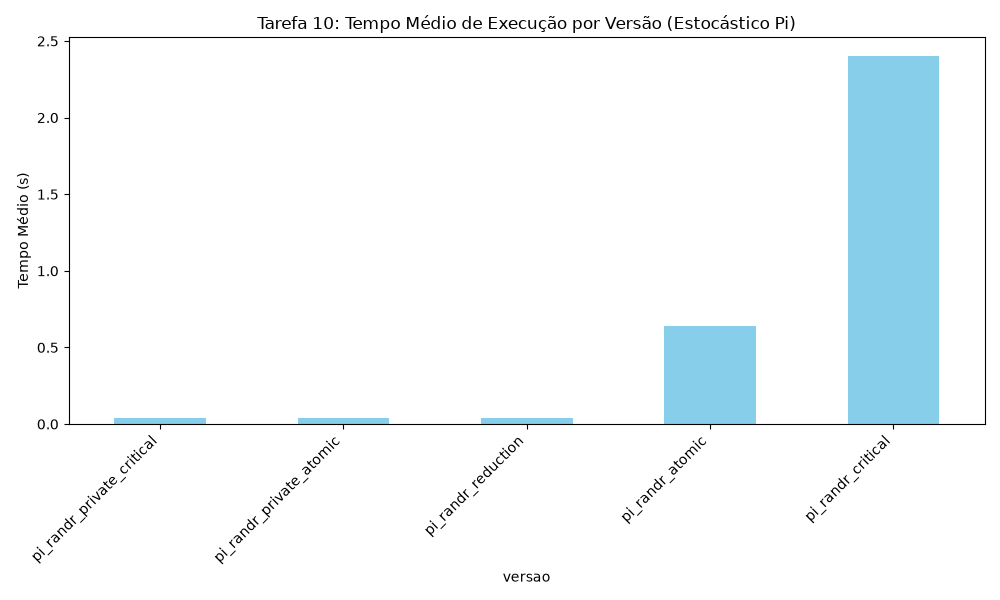

# Relatório - Estimativa Estocástica de Pi com OpenMP

## Objetivo

Reimplementar o estimador de Pi da tarefa 10 com rand_r em cinco versões para comparar desempenho e aplicabilidade dos mecanismos de sincronização:

## Metodologia

Todos os programas foram executados com o mesmo cenário de teste:

- pontos: 100.000.000
- threads: 8 (OMP_NUM_THREADS=8)
- repetições: 5 por versão

Versões implementadas:

- pi_randr_critical.c - `contador compartilhado com critical`
- pi_randr_atomic.c - `contador compartilhado com atomic`
- pi_randr_private_critical.c - `contador privado por thread com soma final em critical`
- pi_randr_private_atomic.c - `contador privado por thread com soma final em atomic`
- pi_randr_reduction.c - `contador privado usando reduction`

## Resultados

Tempo médio das 5 execuções:

| Versão | Pi estimado | Tempo médio (s) |
| --- | --- | ---: |
| rand_r + compartilhado + critical | 3.141310240 | 2.403987 |
| rand_r + compartilhado + atomic | 3.141310240 | 0.639392 |
| rand_r + privado + critical | 3.141310240 | 0.037104 |
| rand_r + privado + atomic | 3.141310240 | 0.037327 |
| rand_r + reduction | 3.141310240 | 0.037623 |


## Análise

A mudança de critical para atomic em contador compartilhado melhorou bastante, mas não resolveu o gargalo principal: ainda existe sincronização a cada acerto dentro do loop.

Quando cada thread acumula em contador privado e sincroniza apenas uma vez no final, a contenção cai drasticamente e o tempo despenca. Por isso private critical, private atomic e reduction ficaram muito próximas.

Sobre produtividade:

- shared critical: muito simples de escrever, porém vira gargalo facilmente
- shared atomic: troca simples e normalmente mais rápida que critical para incrementos
- private + sincronização final: exige pequena reestruturação do código, mas traz ganho grande
- reduction: melhor equilíbrio entre legibilidade e desempenho para padrões de soma/contagem

## Roteiro de uso dos mecanismos de sincronização

1. Podemos comecar por reduction quando o problema for soma, contagem.
2. Usar atomic quando houver atualização curta e simples uma soma por exemplo, em variável compartilhada e não for viável reestruturar para reduction.
3. Usar critical quando a região protegida tiver múltiplas operações que precisam ser executadas como bloco.
4. Usar critical nomeada quando existirem recursos independentes e você quiser reduzir contenção entre trechos não relacionados, como manipulacao de listas diferentes.
5. Usar locks explícitos quando precisar de granularidade por estrutura como lock por lista resolvendo o problema do critical anterior.
6. Evitar sincronizar dentro do loop principal sempre que possível; prefira acumulação local por thread e merge no final.

## Conclusão

Para este problema, o fator decisivo foi reduzir frequência de sincronização. Apenas trocar critical por atomic no contador compartilhado ajuda, mas não compete com estratégias de contador privado.

## Apêndice

Apendice A: pi atomic
```c
#include <stdio.h>
#include <stdlib.h>
#include <omp.h>

int main(int argc, char *argv[])
{
	long long total_pontos = 100000000;
	long long total_dentro = 0;

	if (argc > 1)
	{
		total_pontos = atoll(argv[1]);
	}

	double inicio = omp_get_wtime();

#pragma omp parallel
	{
		int tid = omp_get_thread_num();
		unsigned int seed = 42u + (unsigned int)tid * 97u;

#pragma omp for
		for (long long i = 0; i < total_pontos; i++)
		{
			double x = (double)rand_r(&seed) / RAND_MAX;
			double y = (double)rand_r(&seed) / RAND_MAX;

			if (x * x + y * y <= 1.0)
			{
#pragma omp atomic
				total_dentro++;
			}
		}
	}

	double fim = omp_get_wtime();
	double pi = 4.0 * (double)total_dentro / (double)total_pontos;

	printf("Programa: rand_r + compartilhado + atomic\n");
	printf("Threads: %d\n", omp_get_max_threads());
	printf("Pontos: %lld\n", total_pontos);
	printf("Pi estimado: %.9f\n", pi);
	printf("Tempo: %.6f s\n", fim - inicio);

	return 0;
}
```
Apendice B: pi critical
```c
#include <stdio.h>
#include <stdlib.h>
#include <omp.h>

int main(int argc, char *argv[])
{
	long long total_pontos = 100000000;
	long long total_dentro = 0;

	if (argc > 1)
	{
		total_pontos = atoll(argv[1]);
	}

	double inicio = omp_get_wtime();

#pragma omp parallel
	{
		int tid = omp_get_thread_num();
		unsigned int seed = 42u + (unsigned int)tid * 97u;

#pragma omp for
		for (long long i = 0; i < total_pontos; i++)
		{
			double x = (double)rand_r(&seed) / RAND_MAX;
			double y = (double)rand_r(&seed) / RAND_MAX;

			if (x * x + y * y <= 1.0)
			{
				#pragma omp critical
				{
					total_dentro++;
				}
			}
		}
	}

	double fim = omp_get_wtime();
	double pi = 4.0 * (double)total_dentro / (double)total_pontos;

	printf("Programa: rand_r + compartilhado + critical\n");
	printf("Threads: %d\n", omp_get_max_threads());
	printf("Pontos: %lld\n", total_pontos);
	printf("Pi estimado: %.9f\n", pi);
	printf("Tempo: %.6f s\n", fim - inicio);

	return 0;
}
```
Apendice C: pi private atomic
```c
#include <stdio.h>
#include <stdlib.h>
#include <omp.h>

int main(int argc, char *argv[])
{
	long long total_pontos = 100000000;
	long long total_dentro = 0;

	if (argc > 1)
	{
		total_pontos = atoll(argv[1]);
	}

	double inicio = omp_get_wtime();

#pragma omp parallel
	{
		int tid = omp_get_thread_num();
		unsigned int seed = 42u + (unsigned int)tid * 97u;
		long long local_dentro = 0;

#pragma omp for
		for (long long i = 0; i < total_pontos; i++)
		{
			double x = (double)rand_r(&seed) / RAND_MAX;
			double y = (double)rand_r(&seed) / RAND_MAX;

			if (x * x + y * y <= 1.0)
			{
				local_dentro++;
			}
		}

#pragma omp atomic
		total_dentro += local_dentro;
	}

	double fim = omp_get_wtime();
	double pi = 4.0 * (double)total_dentro / (double)total_pontos;

	printf("Programa: rand_r + privado + atomic\n");
	printf("Threads: %d\n", omp_get_max_threads());
	printf("Pontos: %lld\n", total_pontos);
	printf("Pi estimado: %.9f\n", pi);
	printf("Tempo: %.6f s\n", fim - inicio);

	return 0;
}

```
Apendice D: pi private critical
```c
#include <stdio.h>
#include <stdlib.h>
#include <omp.h>

int main(int argc, char *argv[])
{
	long long total_pontos = 100000000;
	long long total_dentro = 0;

	if (argc > 1)
	{
		total_pontos = atoll(argv[1]);
	}

	double inicio = omp_get_wtime();

#pragma omp parallel
	{
		int tid = omp_get_thread_num();
		unsigned int seed = 42u + (unsigned int)tid * 97u;
		long long local_dentro = 0;

#pragma omp for
		for (long long i = 0; i < total_pontos; i++)
		{
			double x = (double)rand_r(&seed) / RAND_MAX;
			double y = (double)rand_r(&seed) / RAND_MAX;

			if (x * x + y * y <= 1.0)
			{
				local_dentro++;
			}
		}

#pragma omp critical
		{
			total_dentro += local_dentro;
		}
	}

	double fim = omp_get_wtime();
	double pi = 4.0 * (double)total_dentro / (double)total_pontos;

	printf("Programa: rand_r + privado + critical\n");
	printf("Threads: %d\n", omp_get_max_threads());
	printf("Pontos: %lld\n", total_pontos);
	printf("Pi estimado: %.9f\n", pi);
	printf("Tempo: %.6f s\n", fim - inicio);

	return 0;
}

```
Apendice E: pi reduction
```c
#include <stdio.h>
#include <stdlib.h>
#include <omp.h>

int main(int argc, char *argv[])
{
	long long total_pontos = 100000000;
	long long total_dentro = 0;

	if (argc > 1)
	{
		total_pontos = atoll(argv[1]);
	}

	double inicio = omp_get_wtime();

#pragma omp parallel
	{
		int tid = omp_get_thread_num();
		unsigned int seed = 42u + (unsigned int)tid * 97u;

#pragma omp for reduction(+ : total_dentro)
		for (long long i = 0; i < total_pontos; i++)
		{
			double x = (double)rand_r(&seed) / RAND_MAX;
			double y = (double)rand_r(&seed) / RAND_MAX;

			if (x * x + y * y <= 1.0)
			{
				total_dentro++;
			}
		}
	}

	double fim = omp_get_wtime();
	double pi = 4.0 * (double)total_dentro / (double)total_pontos;

	printf("Programa: rand_r + reduction\n");
	printf("Threads: %d\n", omp_get_max_threads());
	printf("Pontos: %lld\n", total_pontos);
	printf("Pi estimado: %.9f\n", pi);
	printf("Tempo: %.6f s\n", fim - inicio);

	return 0;
}

```

### Gráficos

