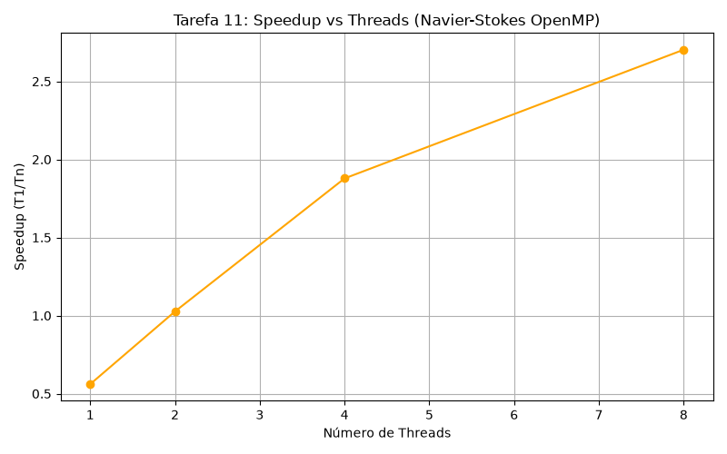

# Relatório - Navier-Stokes com Viscosidade e OpenMP

## Objetivo

Simular a difusão de velocidade de um fluido 2D pela equação `∂u/∂t = ν∇²u`, discretizada com diferenças finitas explícitas. Validar o comportamento físico no código serial e comparar com a versão paralela OpenMP usando `schedule(static) collapse(2)`.

## Configuração

- Grade: 1024×1024 | Δt = 0.1 | ν = 0.5 | Passos: 2000
- CFL: `ν·Δt/Δx² = 0.05 ≤ 0.25` — estável
- Versões: `navier_serial.c` e `navier_static_collapse.c`
- Paralelo testado com 1, 2, 4 e 8 threads (média de 5 execuções)

## Validação Serial

**Perturbação pontual** em (512,512):

```
passo  400: velmax = 0.003994
passo  800: velmax = 0.001993
passo 1200: velmax = 0.001328
passo 1600: velmax = 0.000996
passo 2000: velmax = 0.000796
```

Decaimento monotônico, difusão suave sem instabilidade numérica.

## Resultados

| Versão | Threads | Tempo (s) | Speedup |
| --- | ---: | ---: | ---: |
| serial | 1 | 2.472637 | 1.00× |
| static+collapse | 1 | 4.408868 | 0.56× |
| static+collapse | 2 | 2.409080 | 1.03× |
| static+collapse | 4 | 1.316383 | 1.88× |
| static+collapse | 8 | 0.914911 | 2.70× |


## Conclusão

- Com 1 thread, `collapse(2)` foi **78% mais lento** que o serial.
- A partir de 4 threads o paralelo supera o serial. Com 8 threads o speedup chegou a **2.70×**.
- `collapse(2)` vale a pena apenas quando há threads suficientes para nao obter overhead.

## Apêndice

Apêndice A: navier_serial.c
```c
#include <stdio.h>
#include <stdlib.h>
#include <string.h>
#include <math.h>

#define NX 1024
#define NY 1024
#define DX 1.0
#define DY 1.0
#define DT 0.1
#define NU 0.5
#define STEPS 2000

static double u[NX][NY];
static double u_new[NX][NY];

static void step(void)
{
    for (int i = 1; i < NX - 1; i++) {
        for (int j = 1; j < NY - 1; j++) {
            double lap = (u[i+1][j] - 2.0*u[i][j] + u[i-1][j]) / (DX*DX)
                       + (u[i][j+1] - 2.0*u[i][j] + u[i][j-1]) / (DY*DY);
            u_new[i][j] = u[i][j] + DT * NU * lap;
        }
    }
    for (int i = 1; i < NX - 1; i++)
        for (int j = 1; j < NY - 1; j++)
            u[i][j] = u_new[i][j];
}

static double max_velocity(void)
{
    double mx = 0.0;
    for (int i = 0; i < NX; i++)
        for (int j = 0; j < NY; j++)
            if (fabs(u[i][j]) > mx) mx = fabs(u[i][j]);
    return mx;
}

int main(void)
{
    memset(u, 0, sizeof(u));

    printf("Fase 1: campo uniforme u=0\n");
    for (int t = 0; t < STEPS; t++) step();
    printf("  velocidade maxima apos %d passos: %.6f\n", STEPS, max_velocity());

    memset(u, 0, sizeof(u));
    u[NX/2][NY/2] = 1.0;
    printf("Fase 2: perturbacao unitaria em (%d,%d)\n", NX/2, NY/2);

    for (int t = 1; t <= STEPS; t++) {
        step();
        if (t % 400 == 0)
            printf("  passo %4d: velocidade maxima = %.6f\n", t, max_velocity());
    }

    return 0;
}
```

Apêndice B: navier_static_collapse.c
```c
#include <stdio.h>
#include <stdlib.h>
#include <string.h>
#include <math.h>
#include <omp.h>

#define NX 1024
#define NY 1024
#define DX 1.0
#define DY 1.0
#define DT 0.1
#define NU 0.5
#define STEPS 2000

static double u[NX][NY];
static double u_new[NX][NY];

int main(int argc, char *argv[])
{
    int threads = 4;
    if (argc > 1) threads = atoi(argv[1]);
    omp_set_num_threads(threads);

    memset(u, 0, sizeof(u));
    u[NX/2][NY/2] = 1.0;

    double t0 = omp_get_wtime();

    for (int t = 0; t < STEPS; t++) {
#pragma omp parallel for schedule(static) collapse(2)
        for (int i = 1; i < NX - 1; i++) {
            for (int j = 1; j < NY - 1; j++) {
                double lap = (u[i+1][j] - 2.0*u[i][j] + u[i-1][j]) / (DX*DX)
                           + (u[i][j+1] - 2.0*u[i][j] + u[i][j-1]) / (DY*DY);
                u_new[i][j] = u[i][j] + DT * NU * lap;
            }
        }
#pragma omp parallel for schedule(static) collapse(2)
        for (int i = 1; i < NX - 1; i++)
            for (int j = 1; j < NY - 1; j++)
                u[i][j] = u_new[i][j];
    }

    double elapsed = omp_get_wtime() - t0;

    double mx = 0.0;
    for (int i = 0; i < NX; i++)
        for (int j = 0; j < NY; j++)
            if (fabs(u[i][j]) > mx) mx = fabs(u[i][j]);

    printf("Versao: static+collapse  Threads: %d  Tempo: %.6f s  VelMax: %.6f\n",
           threads, elapsed, mx);
    return 0;
}
```


### Gráficos

