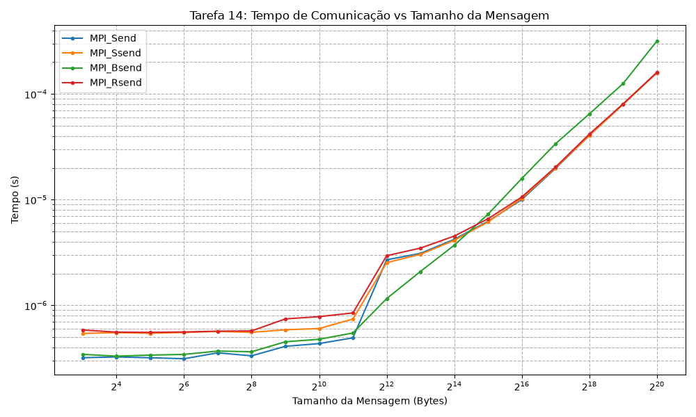

# 14-Tarefa: Ping-Pong com MPI

## Implementações de Envio no MPI
Foram implementadas quatro versões do clássico padrão "ping-pong" (envio e resposta entre dois processos) utilizando diferentes rotinas ponto-a-ponto do MPI:

1. **MPI_Send**
2. **MPI_Ssend (Synchronous Send)**
3. **MPI_Bsend (Buffered Send)**
4. **MPI_Rsend (Ready Send)**

---

## Resultados Medidos

Os testes foram executados com exatamente 2 processos e mensagens de 8 bytes até 1 MiB. A tabela abaixo resume o tempo médio por troca de mensagem, calculado com `MPI_Wtime`.

| Tamanho | MPI_Send (s) | MPI_Ssend (s) | MPI_Bsend (s) | MPI_Rsend (s) |
|---:|---:|---:|---:|---:|
| 8 | 3.20e-07 | 5.43e-07 | 3.44e-07 | 5.85e-07 |
| 16 | 3.25e-07 | 5.53e-07 | 3.31e-07 | 5.59e-07 |
| 32 | 3.20e-07 | 5.44e-07 | 3.39e-07 | 5.56e-07 |
| 64 | 3.13e-07 | 5.54e-07 | 3.44e-07 | 5.61e-07 |
| 128 | 3.56e-07 | 5.67e-07 | 3.70e-07 | 5.70e-07 |
| 256 | 3.33e-07 | 5.56e-07 | 3.64e-07 | 5.74e-07 |
| 512 | 4.10e-07 | 5.88e-07 | 4.53e-07 | 7.45e-07 |
| 1024 | 4.35e-07 | 6.04e-07 | 4.78e-07 | 7.83e-07 |
| 2048 | 4.93e-07 | 7.43e-07 | 5.48e-07 | 8.48e-07 |
| 4096 | 2.70e-06 | 2.54e-06 | 1.16e-06 | 2.95e-06 |
| 8192 | 3.11e-06 | 3.04e-06 | 2.09e-06 | 3.48e-06 |
| 16384 | 4.21e-06 | 4.12e-06 | 3.71e-06 | 4.53e-06 |
| 32768 | 6.24e-06 | 6.15e-06 | 7.28e-06 | 6.59e-06 |
| 65536 | 1.00e-05 | 1.03e-05 | 1.59e-05 | 1.06e-05 |
| 131072 | 1.98e-05 | 2.00e-05 | 3.38e-05 | 2.04e-05 |
| 262144 | 4.05e-05 | 4.05e-05 | 6.48e-05 | 4.17e-05 |
| 524288 | 8.02e-05 | 7.98e-05 | 1.26e-04 | 8.05e-05 |
| 1048576 | 1.59e-04 | 1.59e-04 | 3.16e-04 | 1.61e-04 |


### Leitura dos regimes

Nos tamanhos pequenos, até aproximadamente 2 KiB, o custo é dominado pela latência. As quatro versões ficam muito próximas entre si e os tempos ficam quase constantes. A diferença entre `MPI_Send`, `MPI_Ssend`, `MPI_Bsend` e `MPI_Rsend` aparece mais como custo fixo da operação do que como transferência efetiva de dados.

A partir de 4 KiB, a curva começa a crescer de forma quase linear com o tamanho da mensagem, indicando que a largura de banda passa a dominar. Isso fica mais claro acima de 64 KiB e sobretudo entre 128 KiB e 1 MiB, onde o tempo dobra aproximadamente quando o tamanho também dobra.

### Comparação entre as versões

* `MPI_Send` foi a versão mais equilibrada e, em geral, a mais rápida ou uma das mais rápidas nas mensagens pequenas e médias.
* `MPI_Ssend` ficou consistentemente acima de `MPI_Send`, porque exige sincronização explícita com o receptor.
* `MPI_Bsend` teve baixo custo para mensagens pequenas, mas ficou mais caro em tamanhos maiores, o que é coerente com o uso do buffer adicional e com a cópia local feita antes da comunicação real.
* `MPI_Rsend` teve desempenho próximo de `MPI_Ssend` e `MPI_Send` nas mensagens pequenas e médias, mas depende do pré-agendamento correto do `MPI_Recv` no destino; por isso é a versão mais sensível ao protocolo da aplicação.

---

**Apendice:**


```c
#include <mpi.h>
#include <stdio.h>
#include <stdlib.h>

#define MAX_SIZE (1024 * 1024)
#define EXCHANGES 1000

int main(int argc, char **argv)
{
	int rank, size;
	MPI_Init(&argc, &argv);
	MPI_Comm_rank(MPI_COMM_WORLD, &rank);
	MPI_Comm_size(MPI_COMM_WORLD, &size);

	if (size != 2)
	{
		if (rank == 0)
			printf("Este programa deve ser executado com exatamente 2 processos.\n");
		MPI_Finalize();
		return 1;
	}

	char *buffer = (char *)malloc(MAX_SIZE);

	if (rank == 0)
	{
		printf("Versão: MPI_Send (Standard Send)\n");
		printf("Tamanho(Bytes)\tTempo(s)\n");
	}

	for (int msg_size = 8; msg_size <= MAX_SIZE; msg_size *= 2)
	{
		MPI_Barrier(MPI_COMM_WORLD); // Sincroniza entes de iniciar a bateria

		double start_time = MPI_Wtime();

		for (int i = 0; i < EXCHANGES; i++)
		{
			if (rank == 0)
			{
				MPI_Send(buffer, msg_size, MPI_BYTE, 1, 0, MPI_COMM_WORLD);
				MPI_Recv(buffer, msg_size, MPI_BYTE, 1, 0, MPI_COMM_WORLD, MPI_STATUS_IGNORE);
			}
			else if (rank == 1)
			{
				MPI_Recv(buffer, msg_size, MPI_BYTE, 0, 0, MPI_COMM_WORLD, MPI_STATUS_IGNORE);
				MPI_Send(buffer, msg_size, MPI_BYTE, 0, 0, MPI_COMM_WORLD);
			}
		}

		double end_time = MPI_Wtime();

		if (rank == 0)
		{
			double time_per_msg = (end_time - start_time) / (2.0 * EXCHANGES);
			printf("%d\t\t%e\n", msg_size, time_per_msg);
		}
	}

	free(buffer);
	MPI_Finalize();
	return 0;
}
```

- `pingpong_ssend.c`

```c
#include <mpi.h>
#include <stdio.h>
#include <stdlib.h>

#define MAX_SIZE (1024 * 1024)
#define EXCHANGES 1000

int main(int argc, char **argv)
{
	int rank, size;
	MPI_Init(&argc, &argv);
	MPI_Comm_rank(MPI_COMM_WORLD, &rank);
	MPI_Comm_size(MPI_COMM_WORLD, &size);

	if (size != 2)
	{
		if (rank == 0)
			printf("Este programa deve ser executado com exatamente 2 processos.\n");
		MPI_Finalize();
		return 1;
	}

	char *buffer = (char *)malloc(MAX_SIZE);

	if (rank == 0)
	{
		printf("Versão: MPI_Ssend (Synchronous Send)\n");
		printf("Tamanho(Bytes)\tTempo(s)\n");
	}

	for (int msg_size = 8; msg_size <= MAX_SIZE; msg_size *= 2)
	{
		MPI_Barrier(MPI_COMM_WORLD);

		double start_time = MPI_Wtime();

		for (int i = 0; i < EXCHANGES; i++)
		{
			if (rank == 0)
			{
				MPI_Ssend(buffer, msg_size, MPI_BYTE, 1, 0, MPI_COMM_WORLD);
				MPI_Recv(buffer, msg_size, MPI_BYTE, 1, 0, MPI_COMM_WORLD, MPI_STATUS_IGNORE);
			}
			else if (rank == 1)
			{
				MPI_Recv(buffer, msg_size, MPI_BYTE, 0, 0, MPI_COMM_WORLD, MPI_STATUS_IGNORE);
				MPI_Ssend(buffer, msg_size, MPI_BYTE, 0, 0, MPI_COMM_WORLD);
			}
		}

		double end_time = MPI_Wtime();

		if (rank == 0)
		{
			double time_per_msg = (end_time - start_time) / (2.0 * EXCHANGES);
			printf("%d\t\t%e\n", msg_size, time_per_msg);
		}
	}

	free(buffer);
	MPI_Finalize();
	return 0;
}
```


```c
#include <mpi.h>
#include <stdio.h>
#include <stdlib.h>

#define MAX_SIZE (1024 * 1024)
#define EXCHANGES 1000

int main(int argc, char **argv)
{
	int rank, size;
	MPI_Init(&argc, &argv);
	MPI_Comm_rank(MPI_COMM_WORLD, &rank);
	MPI_Comm_size(MPI_COMM_WORLD, &size);

	if (size != 2)
	{
		if (rank == 0)
			printf("Este programa deve ser executado com exatamente 2 processos.\n");
		MPI_Finalize();
		return 1;
	}

	char *buffer = (char *)malloc(MAX_SIZE);
	int bsend_buffer_size = MAX_SIZE + MPI_BSEND_OVERHEAD;
	char *bsend_buffer = (char *)malloc(bsend_buffer_size);
	MPI_Buffer_attach(bsend_buffer, bsend_buffer_size);

	if (rank == 0)
	{
		printf("Versão: MPI_Bsend (Buffered Send)\n");
		printf("Tamanho(Bytes)\tTempo(s)\n");
	}

	for (int msg_size = 8; msg_size <= MAX_SIZE; msg_size *= 2)
	{
		MPI_Barrier(MPI_COMM_WORLD);

		double start_time = MPI_Wtime();

		for (int i = 0; i < EXCHANGES; i++)
		{
			if (rank == 0)
			{
				MPI_Bsend(buffer, msg_size, MPI_BYTE, 1, 0, MPI_COMM_WORLD);
				MPI_Recv(buffer, msg_size, MPI_BYTE, 1, 0, MPI_COMM_WORLD, MPI_STATUS_IGNORE);
			}
			else if (rank == 1)
			{
				MPI_Recv(buffer, msg_size, MPI_BYTE, 0, 0, MPI_COMM_WORLD, MPI_STATUS_IGNORE);
				MPI_Bsend(buffer, msg_size, MPI_BYTE, 0, 0, MPI_COMM_WORLD);
			}
		}

		double end_time = MPI_Wtime();

		if (rank == 0)
		{
			double time_per_msg = (end_time - start_time) / (2.0 * EXCHANGES);
			printf("%d\t\t%e\n", msg_size, time_per_msg);
		}
	}

	MPI_Buffer_detach(&bsend_buffer, &bsend_buffer_size);
	free(bsend_buffer);
	free(buffer);
	MPI_Finalize();
	return 0;
}
```

```c
#include <mpi.h>
#include <stdio.h>
#include <stdlib.h>

#define MAX_SIZE (1024 * 1024)
#define EXCHANGES 1000

int main(int argc, char **argv)
{
	int rank, size;
	MPI_Init(&argc, &argv);
	MPI_Comm_rank(MPI_COMM_WORLD, &rank);
	MPI_Comm_size(MPI_COMM_WORLD, &size);

	if (size != 2)
	{
		if (rank == 0)
			printf("Este programa deve ser executado com exatamente 2 processos.\n");
		MPI_Finalize();
		return 1;
	}

	char *buffer = (char *)malloc(MAX_SIZE);

	if (rank == 0)
	{
		printf("Versão: MPI_Rsend (Ready Send)\n");
		printf("Tamanho(Bytes)\tTempo(s)\n");
	}

	for (int msg_size = 8; msg_size <= MAX_SIZE; msg_size *= 2)
	{
		MPI_Barrier(MPI_COMM_WORLD);

		double start_time = MPI_Wtime();

		for (int i = 0; i < EXCHANGES; i++)
		{
			if (rank == 0)
			{
				MPI_Recv(NULL, 0, MPI_BYTE, 1, 99, MPI_COMM_WORLD, MPI_STATUS_IGNORE);
				MPI_Rsend(buffer, msg_size, MPI_BYTE, 1, 0, MPI_COMM_WORLD);

				MPI_Send(NULL, 0, MPI_BYTE, 1, 99, MPI_COMM_WORLD);
				MPI_Recv(buffer, msg_size, MPI_BYTE, 1, 1, MPI_COMM_WORLD, MPI_STATUS_IGNORE);
			}
			else if (rank == 1)
			{
				// Manda o OK falando pro Rsend começar
				MPI_Send(NULL, 0, MPI_BYTE, 0, 99, MPI_COMM_WORLD);
				MPI_Recv(buffer, msg_size, MPI_BYTE, 0, 0, MPI_COMM_WORLD, MPI_STATUS_IGNORE);

				MPI_Recv(NULL, 0, MPI_BYTE, 0, 99, MPI_COMM_WORLD, MPI_STATUS_IGNORE);
				MPI_Rsend(buffer, msg_size, MPI_BYTE, 0, 1, MPI_COMM_WORLD);
			}
		}

		double end_time = MPI_Wtime();

		if (rank == 0)
		{
			double time_per_msg = (end_time - start_time) / (2.0 * EXCHANGES);
			printf("%d\t\t%e\n", msg_size, time_per_msg);
		}
	}

	free(buffer);
	MPI_Finalize();
	return 0;
}
```


### Gráficos



### Script de Submissão (`job.sh`)
```bash
#!/bin/bash 
#SBATCH --job-name=pingpong_mpi
#SBATCH --time=0-0:10
#SBATCH --partition=intel-128
#SBATCH --ntasks=2
#SBATCH --nodes=1
#SBATCH --cpus-per-task=1

# O módulo do MPI precisa estar carregado no NPAD
# module load mpi/openmpi-x86_64

make clean
make

echo "=== MPI_Send ==="
mpirun -np 2 ./pingpong_send

echo "================="
echo "=== MPI_Ssend ==="
mpirun -np 2 ./pingpong_ssend

echo "================="
echo "=== MPI_Bsend ==="
mpirun -np 2 ./pingpong_bsend

echo "================="
echo "=== MPI_Rsend ==="
mpirun -np 2 ./pingpong_rsend

```
