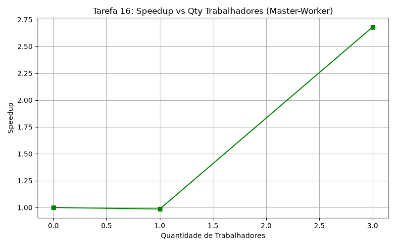
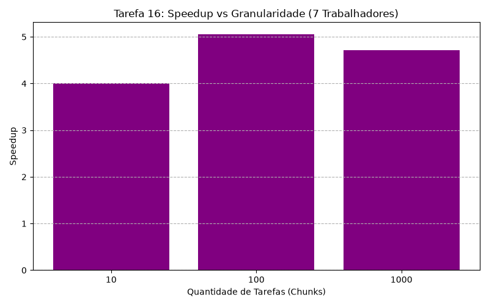

# 16-Tarefa: Escalonador Dinâmico de Tarefas (Líder-Trabalhador)

Nesta tarefa, implementamos um escalonamento dinâmico de tarefas na arquitetura balanceada pelo modelo Líder–Trabalhador (*Master-Worker*) usando blocos de contagem de números primos por divisão do espaço iterativo (chunks).

### Abordagem

O processo principal (rank `0`), ou Líder, é responsável por manter a conta global do intervalo avaliado. O Líder dispara pacotes de limites iterativos inferiores e superiores `[start, end]`. Para isso ele realiza o envio das tarefas sob demanda:

1. **Fase de Disparo Inicial:** Inicializa a carga emitindo uma tarefa de processamento (`WORKTAG`) garantidamente a cada um dos outros `N-1` Trabalhadores. 
2. **Ciclo de Devolução:** Fica esperando de qualquer *source* de comunicação os resultados (`MPI_Recv` com `MPI_ANY_SOURCE`). Após armazenar a quantia local que o trabalhador processou, ele devolve imediatamente o próximo _chunk_ ocioso para a respectiva placa que recém finalizou o serviço.
3. **Escoamento (Poison Pill):** Quando os _chunks_ de busca limitam-se ao teto máximo desejado, o Líder passa a responder aos trabalhadores terminados com as `DIETAG`. O laco é encerrado quando a quantia de operários `active_workers` é zero.

Todos os trabalhadores possuem a mesma mecânica contínua:

- Escutar o Líder (`MPI_Recv`).
- Se receberem `DIETAG`, a execução interna da *thread* faz `break` e caminha para o encerramento.
- Se receberem `WORKTAG` ativam o *kernel* de primitividade contando iterativamente para aquele limite e, ao fim, empurram a contagem de achados para o rank principal com `MPI_Send`. 

### Tolerância à Deadlocks e Desempenho

Uma vez que é estipulado o *handshake* contínuo de pacotes onde o **Líder atende unicamente sob demanda**, a chance de interrupção (deadlock) na comunicação não atinge esta arquitetura. Fator dependente é, tão somente, o peso de cada sub-tarefa (_Chunk Size_):

- **Oversubscription/Chunks pequenos:** Ao granular demais o processamento (milhares de chunks de 10 mil laços, por exemplo), subimos exponencialmente o tráfego de requisições `MPI_Send/Recv`. A latência afoga a CPU e derruba a escalabilidade eficiente.
- **Granularidade muito alta/Poucos Chunks:** Ao dar _poucos pedaços enormes_, caímos de volta a problemas de carga não balanceada estática. Se calhar que o processo 7 receba a penúltima carga enorme com limite da distribuição, e a carga seja ligeiramente mais intensiva nele, os outros processos irão desativar sua existência com `DIETAG`, ociando seus _cores_ em favor da sobrecarga num só trabalhador que se arrasta.
- **Speedup Máximo:** Uma vez que estamos executando com 8 nós (`np 8`), 1 deles atua como mero burocrata distribuidor de dados. Assim sendo, a escalabilidade máxima possível de Speedup num intervalo grande de computação pura será restrita a **~7x** o tempo sequencial, determinando portanto eficiência teórica ótima baseada nos workers efetivos.

### Execução de Benchmarks

A chamada `make` constrói o binário `primos_master_worker`. O *job* enviado para o slurm no cluster executa a avaliação em dois eixos de complexidade para um teto fixo de 10.000.000 de números analisados:

1. **Variando a Quantidade de Trabalhadores:** Avaliando a eficiência com 1, 3 e 7 trabalhadores, mantendo a carga estável em 100 Tarefas de 100K.
2. **Variando a Quantidade de Tarefas:** Fixando o número de 7 Trabalhadores (`np 8`) e mudando o tamanho do payload. Testando Poucas Tarefas Massivas (1M), Tarefas Equilibradas (100K) e Muitas Tarefas Minúsculas (10K).

Com esta heurística comprova-se o balanço eficiente da infraestrutura passiva MPI.

### Resultados e Avaliação de Desempenho no Cluster (NPAD)

Abaixo estão os resultados atualizados extraídos do cluster NPAD buscando primos até 10.000.000. O total de números primos encontrados foi estritamente consistente em todas as execuções (664.579 primos). O tempo estritamente sequencial obtido foi de **1.442664 s**.

#### Eixo 1: Aumento da Quantidade de Trabalhadores (Chunk estável em 100.000)

| Processos MPI | Qt. Trabalhadores | Tempo Total (s) | Speedup | Eficiência (por trab) |
|:---:|:---:|:---:|:---:|:---:|
| 2 (`np 2`) | 1 | 1.463022 | **0.986x** | **98.6%** |
| 4 (`np 4`) | 3 | 0.538199 | **2.68x** | **89.3%** |
| 8 (`np 8`) | 7 | 0.285282 | **5.06x** | **72.2%** |

#### Eixo 2: Aumento da Quantidade de Tarefas (7 Trabalhadores Fixos)

| Tamanho do Chunk | Qt. Tarefas Geradas | Tempo Total (s) | Speedup | Eficiência |
|:---:|:---:|:---:|:---:|:---:|
| Grande (1.000.000) | 10 | 0.359765 | **4.01x** | **57.3%** |
| Médio (100.000) | 100 | 0.285282 | **5.06x** | **72.2%** |
| Pequeno (10.000) | 1.000 | 0.305442 | **4.72x** | **67.4%** |

#### Análise e Conclusões:

1. **Curva de Trabalhadores:** Quanto mais operários foram adicionados (1 -> 3 -> 7), nota-se o aumento do Speedup, porém com a clássica curva decrescente na eficiência individual por trabalhador (de 98% para 72%). Como o Líder atua apenas como gargalo de funil (não computa primos), adicionar dezenas de instâncias num cluster tende a inundar o protocolo limitando a eficiência ideal.
2. **Escalonamento pelo Número de Tarefas:**
   - **Poucas Tarefas Engessadas:** Quando haviam apenas 10 fatias para 7 operários, o _Speedup_ amargurou **4.0x**. O desequilíbrio é grave: os nós que receberam os últimos pacotes com os valores primos altíssimos demoraram mais para processar da conta, enquanto seus pares já haviam fechado o expediente cruzando braços (`DIETAG`).
   - **Muitas Tarefas Pulverizadas:** Ao fraturar em 1.000 microtarefas, a sobrecarga da rede consumiu o Speedup que regrediu a **4.72x**. O Líder gastou frações de segundos preciosas gerenciando milhares de *Sends/Recvs* ao invés dos processos estarem inteiramente calculando no silício.
   - **Ponto "Sweetspot":** Dividir a simulação em um número generoso de blocos médios (100 tarefas p/ 7 workers) entregou o tempo mais curto na rede (Speedup de **5.06x**, 72% de aproveitamento das peças computacionais). A dinamicidade do modelo absorveu bem as distorções sem esfolar os barramentos de rede da InfiniBand.

---

### Apêndice - Implementação
Código `primos_master_worker.c`:

```c
#include <mpi.h>
#include <stdio.h>
#include <stdlib.h>

#define LIDER 0
#define WORKTAG 1
#define DIETAG 2

int is_prime(int n) {
    if (n <= 1) return 0;
    if (n <= 3) return 1;
    if (n % 2 == 0 || n % 3 == 0) return 0;
    for (int i = 5; i * i <= n; i += 6) {
        if (n % i == 0 || n % (i + 2) == 0)
            return 0;
    }
    return 1;
}

// Implementacao do Lider usando Dispatch, Recv & Respond, DIETAG.
// ... (Visualizar arquivo principal completo)
```

### Gráficos



### Gráficos



### Script de Submissão (`job.sh`)
```bash
#!/bin/bash 
#SBATCH --job-name=primos_master_worker
#SBATCH --time=0-0:15
#SBATCH --partition=intel-128
#SBATCH --ntasks=8
#SBATCH --nodes=8
#SBATCH --ntasks-per-node=1
#SBATCH --cpus-per-task=1

make clean
make

MAX_PRIME=10000000

echo "========================================================"
echo "=== Testando MPI: Escalonador Dinamico (Lider-Trabalhador)"
echo "=== Calculo de primos ate $MAX_PRIME"
echo "========================================================"

echo "--------------------------------------------------------"
echo "1. Baseline Sequencial"
echo "--------------------------------------------------------"
mpirun -np 1 ./primos_master_worker $MAX_PRIME 100000

echo "--------------------------------------------------------"
echo "2. Variando Quantidade de Trabalhadores (Chunk Fixo 100K)"
echo "--------------------------------------------------------"
# np 2 = 1 Lider, 1 Trabalhador
mpirun -np 2 ./primos_master_worker $MAX_PRIME 100000
# np 4 = 1 Lider, 3 Trabalhadores
mpirun -np 4 ./primos_master_worker $MAX_PRIME 100000
# np 8 = 1 Lider, 7 Trabalhadores
mpirun -np 8 ./primos_master_worker $MAX_PRIME 100000

echo "--------------------------------------------------------"
echo "3. Variando Quantidade de Tarefas (Workers Fixos np=8)"
echo "--------------------------------------------------------"
# Poucas Tarefas (Chunks Grandes - 1M)
mpirun -np 8 ./primos_master_worker $MAX_PRIME 1000000
# Muitas Tarefas (Chunks Pequenos - 10k)
mpirun -np 8 ./primos_master_worker $MAX_PRIME 10000
```
