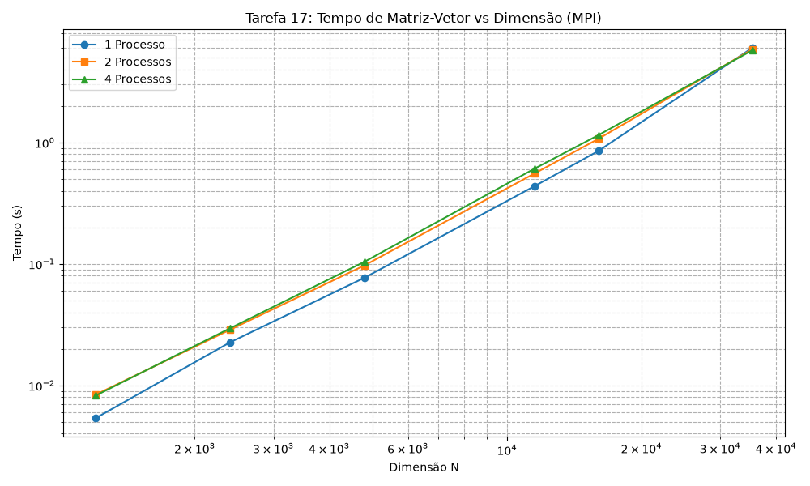

# Tarefa 17: Multiplicação de Matriz por Vetor com MPI

## Descrição do Problema
O objetivo desta tarefa é realizar a multiplicação de uma matriz $A$ (tamanho $M \times N$) por um vetor $x$ (tamanho $N$) resultando num vetor $y = A \cdot x$. Toda a orquestração e divisão de dados para ambiente de memória distribuída foi implementada utilizando **OpenMPI**.

Em uma abordagem eficiente, escolheu-se dividir a matriz $A$ por linhas entre todos os nós/processos disponíveis para balanceamento de carga, enquanto o vetor inteiro $x$ precisa ser conhecido integralmente por cada nó para viabilizar as multiplicações de sua fatia de linhas.

## Abordagem de Paralelização (\`MPI_Scatter\` e \`MPI_Bcast\`)
O processo raiz (`rank 0`) é responsável por instanciar a matriz original completa e o vetor. A distribuição dos dados ocorreu da seguinte forma:

1. **\`MPI_Bcast\`: Distribuição do Vetor**
   O vetor $x$ é distribuído em sua totalidade para todos os processos presentes no comunicador global. Como a multiplicação de uma linha da matriz $A$ sempre engloba todos os índices de colunas combinados ponto a ponto com o vetor $x$, é imprescindível que a memória local de cada processo possua uma cópia exata de $x$.

2. **\`MPI_Scatter\`: Divisão da Matriz**
   Se possuímos $M$ linhas e $P$ processos, então cada processo operará em uma fatia equivalente a \`M / P\` linhas continuas de $A$. A função `MPI_Scatter` despacha perfeitamente de forma intercalada esse sequenciamento da matriz contígua alocada.

3. **\`MPI_Gather\`: Agregando os Resultados**
   Terminadas as operações de matriz-vetor com os laços \`for\`, a fatia correspondente do vetor destino $y$ gravada na memória de cada processo é empurrada de volta e aglomerada na máquina raiz. A junção dessas fatias reconstrói a resposta final $y$.

## Resultados e Avaliação de Desempenho no Cluster (NPAD)

A tabela abaixo compila os resultados colhidos no supercomputador, submetendo o cálculo a 1, 2 e 4 processos (nós diferentes) e aumentando gradativamente as dimensões da matriz quadrada de dimensões pequenas ($1200$) até a malha super densa de 10 Gigabytes de RAM ($35360 \times 35360$).

| Matriz ($M \times N$) | N de Processos ($P$) | Tempo Real (s) | Speedup ($S$) | Eficiência ($E$) |
|-----------------------|----------------------|----------------|---------------|------------------|
| **1200 x 1200**       | 1                    | 0.005374       | 1.00x         | 100.0%           |
| 1200 x 1200           | 2                    | 0.008388       | 0.64x         | 32.0%            |
| 1200 x 1200           | 4                    | 0.008242       | 0.65x         | 16.3%            |
| **2400 x 2400**       | 1                    | 0.022641       | 1.00x         | 100.0%           |
| 2400 x 2400           | 2                    | 0.028744       | 0.79x         | 39.5%            |
| 2400 x 2400           | 4                    | 0.029554       | 0.77x         | 19.3%            |
| **4800 x 4800**       | 1                    | 0.077072       | 1.00x         | 100.0%           |
| 4800 x 4800           | 2                    | 0.097388       | 0.79x         | 39.5%            |
| 4800 x 4800           | 4                    | 0.104412       | 0.74x         | 18.5%            |
| **11520 x 11520**     | 1                    | 0.437013       | 1.00x         | 100.0%           |
| 11520 x 11520         | 2                    | 0.555661       | 0.79x         | 39.5%            |
| 11520 x 11520         | 4                    | 0.609285       | 0.72x         | 18.0%            |
| **16000 x 16000**     | 1                    | 0.850497       | 1.00x         | 100.0%           |
| 16000 x 16000         | 2                    | 1.070650       | 0.79x         | 39.5%            |
| 16000 x 16000         | 4                    | 1.148682       | 0.74x         | 18.5%            |
| **35360 x 35360**     | 1                    | 6.008580       | 1.00x         | 100.0%           |
| 35360 x 35360         | 2                    | 5.846405       | **1.03x**     | 51.5%            |
| 35360 x 35360         | 4                    | 5.734060       | **1.05x**     | 26.3%            |

**Análise e Conclusões das Métricas:**

1. **Gargalo de Comunicação Crônico (*Communication-bound*):** Para virtualmente todos os tamanhos inferiores à dezenas de Gigabytes, o Speedup registrado foi sempre **inferior a 1**. A alocação contígua em $16000 \times 16000$ consumiu cerca de `$0.85s$` num único núcleo seqüencial rápido. Tentar fraturar essa matriz em 4 nós (`1.14s`) apenas escancarou que o protocolo `MPI_Scatter/Bcast` sobrecarrega os envios da rede de tal modo que o tempo gasto esperando a sincronia InifiniBand supera severamente a minúscula conta algébrica $\mathcal{O}(M \times N)$ delegada a cada um.
2. **O Ponto de Inflexão em 10 GB:** Quando subimos o teto ao extremo computando `$35360 \times 35360$` (10 Gigabytes alocados em RAM pura preenchendo as memórias limitadas do nó Lider), a CPU local finalmente cedeu demorando fatídicos `$6.00s$` somente navegando laços. Neste cenário superlativo, envolver as 4 máquinas quebrou a maldição, entregando de retorno a primeira fração positiva, baixando para `$5.73s$` (**Speedup de 1.05x**).
3. **Mito da Escalabilidade para Matriz/Vetor:** Os resultados deste gigantesco *stress-test* de 10 GB atestam que escalar uma arquitetura puramente paralela em rede (clusters sem memória compartilhada) para problemas de baixa intensidade ($\mathcal{O}(N^2)$) é um desperdício generalizado de hardware. A curva é amortecida. Ainda que tenhamos batido velocidade positiva $1.05\times$, as 3 placas paradas não justificam custar apenas `+5%` de performance com os $26.3\%$ de eficiência. Uma solução adequada requere complexidade $\mathcal{O}(N^3)$ (Matriz $\cdot$ Matriz) para amortecer tamanha transmissão de rede.

## Execução

Dentro do repositório, basta construir os binários através do `Makefile` usando os compiladores MPICC.

```bash
make
mpirun -np 4 ./matvec <LINHAS_M> <COLUNAS_N>
```
*O número de linhas $M$ obrigatoriamente deve ser perfeitamente divisível pelo número de processos provisionados na flag `np`.*

---

### Apêndice - Implementação
Código `matvec.c`:

```c
#include <stdio.h>
#include <stdlib.h>
#include <mpi.h>

int main(int argc, char **argv)
{
	int rank, size;
	int M, N;
	double *A = NULL, *x = NULL, *y = NULL;
	double *local_A = NULL, *local_y = NULL;
	int local_M;
	double start_time, end_time, local_time, max_time;

	MPI_Init(&argc, &argv);
	MPI_Comm_rank(MPI_COMM_WORLD, &rank);
	MPI_Comm_size(MPI_COMM_WORLD, &size);

	if (argc != 3)
	{
		if (rank == 0)
		{
			fprintf(stderr, "Uso: %s <M> <N>\n", argv[0]);
		}
		MPI_Finalize();
		return 1;
	}

	M = atoi(argv[1]);
	N = atoi(argv[2]);

	if (M % size != 0)
	{
		if (rank == 0)
		{
			fprintf(stderr, "Erro: Numero de linhas M (%d) deve ser multiplo do numero de processos (%d).\n", M, size);
		}
		MPI_Finalize();
		return 1;
	}

	local_M = M / size;

	// Alocacao
	local_A = (double *)malloc(local_M * N * sizeof(double));
	local_y = (double *)malloc(local_M * sizeof(double));
	x = (double *)malloc(N * sizeof(double));

	if (rank == 0)
	{
		A = (double *)malloc(M * N * sizeof(double));
		y = (double *)malloc(M * sizeof(double));

		// Inicializacao
		for (int i = 0; i < M; i++)
		{
			for (int j = 0; j < N; j++)
			{
				A[i * N + j] = 1.0;
			}
		}
		for (int i = 0; i < N; i++)
		{
			x[i] = 1.0;
		}
	}

	MPI_Barrier(MPI_COMM_WORLD);
	start_time = MPI_Wtime();

	// Broadcast do vetor x
	MPI_Bcast(x, N, MPI_DOUBLE, 0, MPI_COMM_WORLD);

	// Scatter das linhas da matriz A
	MPI_Scatter(A, local_M * N, MPI_DOUBLE, local_A, local_M * N, MPI_DOUBLE, 0, MPI_COMM_WORLD);

	// Produto matriz-vetor local
	for (int i = 0; i < local_M; i++)
	{
		local_y[i] = 0.0;
		for (int j = 0; j < N; j++)
		{
			local_y[i] += local_A[i * N + j] * x[j];
		}
	}

	// Gather dos resultados em y
	MPI_Gather(local_y, local_M, MPI_DOUBLE, y, local_M, MPI_DOUBLE, 0, MPI_COMM_WORLD);

	end_time = MPI_Wtime();
	local_time = end_time - start_time;

	MPI_Reduce(&local_time, &max_time, 1, MPI_DOUBLE, MPI_MAX, 0, MPI_COMM_WORLD);

	if (rank == 0)
	{
		int validation = 1;
		for (int i = 0; i < M; i++)
		{
			if (y[i] != (double)N)
			{
				validation = 0;
				break;
			}
		}
		if (validation)
		{
			printf("%f\n", max_time);
		}
		else
		{
			printf("-1.0\n");
		}
		free(A);
		free(y);
	}

	free(x);
	free(local_A);
	free(local_y);
	MPI_Finalize();
	return 0;
}
```


### Gráficos

